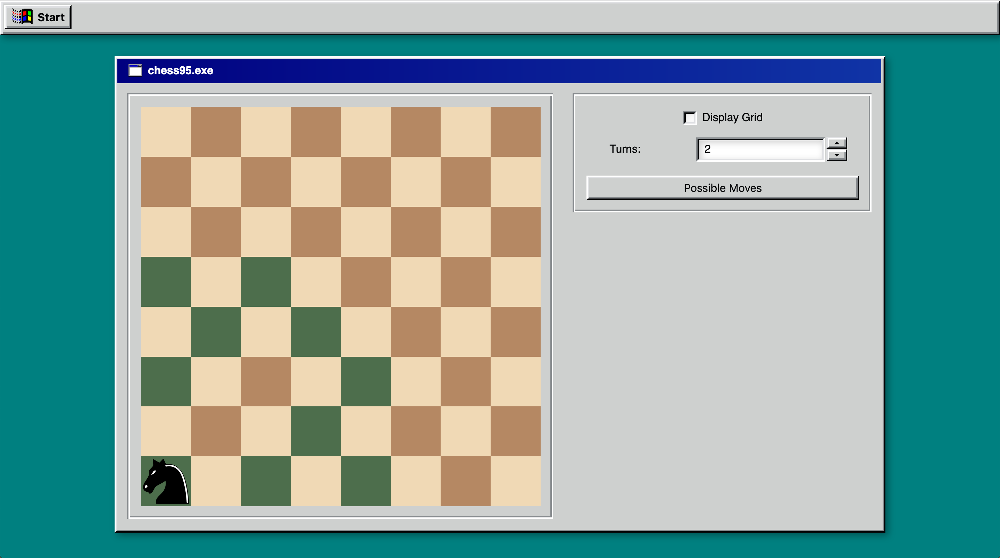

# Chess 95 ♟

Chess 95 is web application that allows the user to simulate knight movements in N turns. The UI was inspired by windows 95 components which makes a nostalgic feeling when playing with it.

The application was bootstraped with AEboilerplate, a full-stack React/Redux/Node/Typescript web project starter that made development easier, clean and customizable. In addition, other important aspects like deployment and testing were ready to use out of the box.

## Project Structure

Most of the architecture was inherited from AEboilerplate with a few additions. The application is divided in two independent applications. The **api**, which represents the back-end built on top of NodeJs, Express and PostgreSQL database. And the **client**, a front-end application generated using `create-react-app`.

Here's a list describing each technology used by each application:

- Client
  - Generated using [create-react-app](https://github.com/facebook/create-react-app) with [Typescript](https://www.typescriptlang.org/docs/home.html) and [SASS](https://sass-lang.com/).
  - [Axios](https://github.com/axios/axios) for the HTTP client.
  - [Redux](https://github.com/reduxjs/redux) using the [ducks modular approach](https://github.com/erikras/ducks-modular-redux) for state management.
  - [React Router 4](https://reacttraining.com/react-router/core/guides/philosophy) for routing. \* [Jest](https://jestjs.io/) and [Enzyme](https://github.com/airbnb/enzyme) for testing.
  - [Reselect](https://github.com/reduxjs/reselect) simple redux state selector library. Selectors can compute derived data (allowing store to be minimal as possible), efficient using function memoize and composable (a selector can use other selector as a input). Selectors tend to be easy to test because they are pure functions.
  - [React95](https://github.com/arturbier/React95) for UI components inspired by Windows 95 styles.
- API
  - [Express](https://expressjs.com/) for routing.
  - [Postgres](https://www.postgresql.org/about/) database and [Knex](https://knexjs.org/) for query building. [Migrations](https://knexjs.org/#Migrations-CLI) and [seeds](https://knexjs.org/#Seeds-CLI) are included. \* [Jest](https://jestjs.io/) for testing.
  - [Ramda](https://ramdajs.com/) javascript library designed for a functional programming style.
- [Docker](https://docs.docker.com) and [docker compose](https://docs.docker.com/compose/) for running applications locally.
- [prettier](https://github.com/prettier/prettier), [editorconfig](https://editorconfig.org/), and [tslint](https://palantir.github.io/tslint/) for consistent code formatting.
- [Github templates](https://blog.github.com/2016-02-17-issue-and-pull-request-templates/) for Github pull request templates.

All code related to Chess 95 application is scoped in a `/chess` folder. Here's a list covering it:

- Api
- Services: `api/src/services/chess`
- Endpoints: `api/src/api/chess`
- Client
- Components: `client/src/components/chess`
- Containers: `client/src/containers/chess`
- Redux: `client/src/redux/ducks/chess`
- Selectors: `client/src/selectors/chess.ts`

## Contributing

Disclaimer to AEBoilerplate docs and link to CONTRIBUTING.md

## Futher working

[] Setup circle-ci
[] Add more typescript features to components and functions
